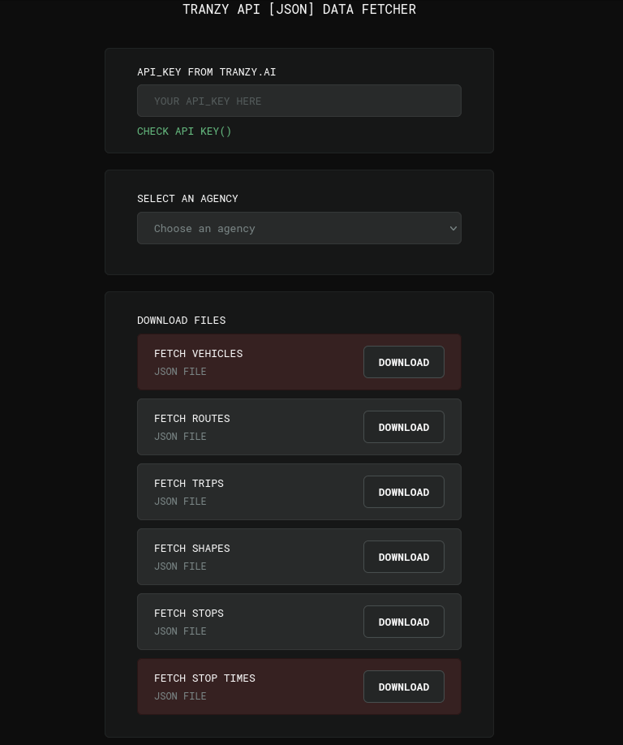

# Tranzy [JSON] Data Fetcher

Download public data from Tranzy.ai as JSON file

## Preview



## Features

- API Key validation
- Dynamic agency selection
- Endpoint based JSON downloads
- Minimal UI


## How it works
1. Enter your API key
2. Select an available agency
3. Choose an endpoint (vehicles, routes, trips, shapes, stops, stop times);
4. Download the data as JSON

## Getting started
1. Clone the repository
2. Open the project folder
3. Run a local server (recommended)

## Project structure
```text
/assets
    fonts
    icons
/css
    reset.css
    style.css
/src
    /api
        agency.js
        config.js
        routes.js
        shapes.js
        state.js
        stopTimes.js
        stops.js
        trips.js
        vehicles.js
    /jszip
        jszip.js
        jszip.min.js
CHANGELOG.md
README.md
api-structure.html
faq.html
favicon.png
index.html
main.js
```
## Tech Stack
- Vanilla JavaScript
- Fetch API
- HTML/CSS


